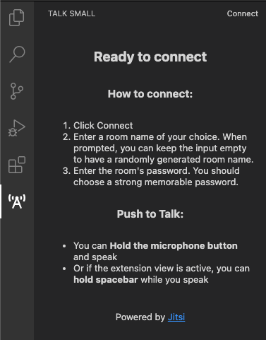

### Talk Small

#### Screenshots:

1. Connect
    * Using `talk-small:connect` command

        
    
    * Using `Connect` button in `talk-small` view 

        

    * Disconnection can be done the same way, i.e. via `talk-small.disconnect`
    command or via `Disconnect` button in `talk-small` view

2. Enter optional room name

    
    
    - The input will be prefilled with last used room name for quick access
    - If this input is left empty, the extension will generate a random room name for you

3. Enter required password

    

4. Connected

    

5. Speaking

    

6. Example conference

    
