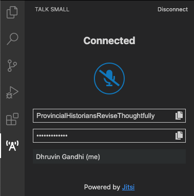
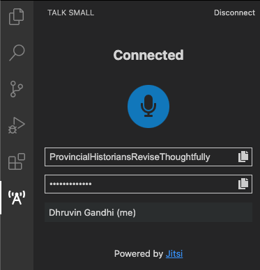

# Talk Small

## Preface:

Due to recent events (COVID-19), everyone started working remotely, completely.
Effective ways to communicate with your team while working becomes not just
*essential* but **necessary**.

As a developer, I spend majority of my day working inside my IDE. It's a
software with which I'm quite fluent. I think it's true for many developers.
With the shift in how we work, I think our tools need an upgrade as well.
After all, we are as efficient as our tools.

## Idea: Talk Small

A Push to Talk (PTT) client, built on top of Jitsi, right inside
[Visual Studio Code](https://marketplace.visualstudio.com/items?itemName=dhruvin-dev.talk-small).

Talk Small's purpose is to provide a persistent communication channel.
You use it only when you want to broadcast/reply.
Like a [HAM Radio](https://en.wikipedia.org/wiki/Amateur_radio), but for VSCode. 
You can be free in your creative space. No more muting yourself after speaking.
Or worse, forgetting muting yourself even after speaking.

If you played multiplayer games, you may have used in-game audio chat solution.
Or maybe discord. It's a game changer! Haha.

Talk small is similar to it. You host/join a room. But your audio is sent only
while you hold the spacebar key or the microphone button. Unlike an open-mic.

There are some alternatives like
[Live Share by Microsoft](https://docs.microsoft.com/en-us/visualstudio/liveshare/)
and [Code With Me by JetBrains](https://blog.jetbrains.com/blog/2020/09/28/code-with-me-eap/)
that are built mainly for active sessions.

## Use cases:

1. Push to Talk can be helpful in time-bound collaborative team tasks, like
remote hackathons, where all team members are communicating with each-other
quite often.

1. As remote stand-up meeting client. Since stand-up meetings are usually short,
and you chime in only when needed, you can do it right from your editor.

1. As @ThisIsJohnBrown suggested during the hackathon, it can be that "war room"
during releases for easy communication, which is basically just everyone sitting
muted on a call.

## Screenshots:

1. Connect
    * Using `talk-small:connect` command

        
    
    * Using `Connect` button in `talk-small` view 

        

    * Disconnection can be done the same way, i.e. via `talk-small.disconnect`
    command or via `Disconnect` button in `talk-small` view

2. Enter optional room name

    
    
    - The input will be prefilled with last used room name for quick access
    - If this input is left empty, the extension will generate a random room name for you

3. Enter required password

    

4. Connected

    

5. Speaking

    

6. Example conference

    

## Links:

- [Project](https://github.com/dhruvin2910/talk-small)
- [Issues](https://github.com/dhruvin2910/talk-small/issues)
